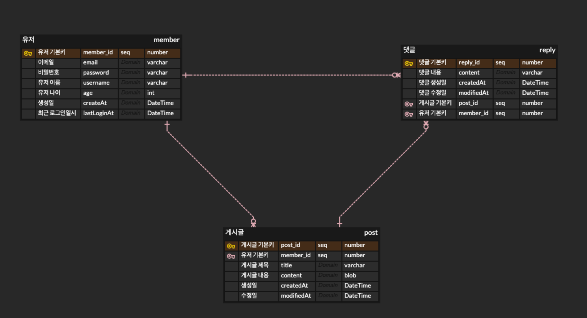
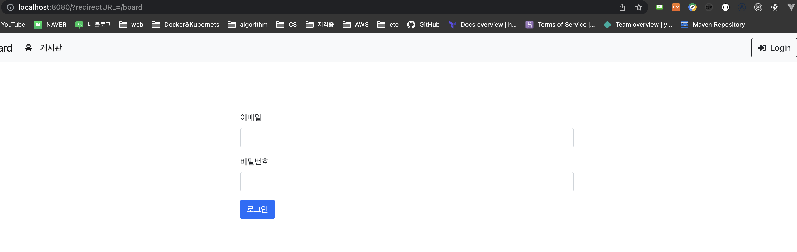
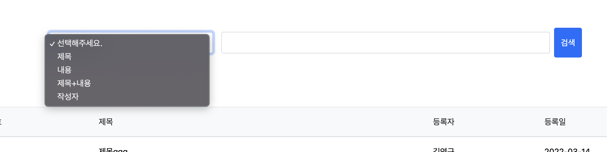

게시판 만들기 프로젝트
================

## 1. 기술 스택 
#### - FrontEnd - thymeleaf
#### - BackEnd - Spring boot 
#### - Database - H2 Database
#### - ORM - JPA 


## 2. 기능 
1. 공통
    - 로그인을 하지않으면, 게시판 접근이 불가능하다.  (ok)

2. 유저
    - 회원가입  (ok)
        - 비밀번호는 암호화하여야 한다. (ok)
    - 로그인 (ok)
    - 로그아웃 (ok)

1. 게시글
    - 게시글 등록 (ok)
    - 게시글 수정 (ok)
    - 게시글 삭제 (ok)
    - 게시글 전체 조회 (ok)
        - paging이 가능하여야 한다.  (ok)
        - 한 페이지에 10개의 게시글이 나와야 한다.  (ok)
    - 게시글 검색 조회
        - 제목 검색 (ok)
        - 내용 검색 (ok)
        - 작성자 검색 (ok)

1. 댓글
    - 댓글 등록 (ok)
    - 댓글 삭제 (ok)
        - 댓글을 작성한 사람 뿐 아니라 게시글 작성자도 삭제가 가능하여야 한다.
    - 댓글 조회 (ok)
        - 게시글을 조회할 때, 댓글도 함께 조회가 되어야 한다.

## 3. ERD 


## 4. 주요 기능
|이미지|설명
|------|---|
||만약 로그인이 안되어 있는 상태에서 게시판을 들어가려면 로그인창으로 이동하고, redirectionURL을 만든다. 로그인할 경우 가고자 했던 url로 간다.
||제목, 내용, 제목+내용, 작성자를 기반으로 동적 검색이 가능하다. 이 기능은 querydsl을 사용했다. |
||게시글을 페이징하여, 하단 부에 다른 페이지로 갈 수 있게끔 만들었다. 이것은 동적으로 게시글의 개수를 파악하고, 첫 번째 인 경우는 prev를 없애고, 마지막이면 next가 없어진다.

## 5. 주요 코드
### 1. 인터셉터로 비안가 접근을 막고 (비로그인) 로그인창으로 Redirect
```java
@Slf4j
public class LoginCheckInterceptor implements HandlerInterceptor {

   @Override
   public boolean preHandle(HttpServletRequest request, HttpServletResponse response, Object handler) throws Exception {

      String requestURI = request.getRequestURI();
      HttpSession session = request.getSession(false);

      log.info("session = {}", session);

      if (session == null || session.getAttribute(SessionConst.LOGIN_MEMBER) == null) {
         response.sendRedirect("/?redirectURL=" + requestURI);
         return false;
      }
      return true;
   }
}
```

### 2. 게시글 페이징 쿼리
- Client에서 넘겨받을 때는, Query Parameter로 받는다. 
```java
@Slf4j
public class PostRepositoryImpl implements PostRepositoryCustom{

    private final EntityManager em;
    private final JPAQueryFactory queryFactory;


    public PostRepositoryImpl(EntityManager em) {
        this.em = em;
        queryFactory = new JPAQueryFactory(em);
    }

    @Override
    public Page<PostDto> findAllPosts(Pageable pageable) {
        QueryResults<PostDto> result = queryFactory
                .select(new QPostDto(
                        post.id,
                        post.title,
                        post.content,
                        member.username,
                        post.createdAt,
                        post.modifiedAt
                ))
                .from(post)
                .leftJoin(post.member, member)
                .orderBy(post.createdAt.desc())
                .offset(pageable.getOffset())
                .limit(pageable.getPageSize())
                .fetchResults();

        List<PostDto> content = result.getResults();
        long total = result.getTotal();
        return new PageImpl<>(content, pageable, total);
    }


    @Override
    public Page<PostDto> findPostSearch(PostSearch search, Pageable pageable) {
        QueryResults<PostDto> result = queryFactory
                .select(new QPostDto(
                        post.id,
                        post.title,
                        post.content,
                        member.username,
                        post.createdAt,
                        post.modifiedAt
                ))
                .from(post)
                .leftJoin(post.member, member)
                .where(
                        titleAndContentContain(search.getConditionString(), search.getCheckBoxSelect())
                )
                .orderBy(post.createdAt.desc())
                .offset(pageable.getOffset())
                .limit(pageable.getPageSize())
                .fetchResults();


        List<PostDto> content = result.getResults();
        long total = result.getTotal();
        return new PageImpl<>(content, pageable, total);
    }


    // 제목만 검색, 내용만 검색, 제목+내용 검색
    private BooleanExpression titleAndContentContain(String conditionString, CheckBoxSelect checkBoxSelect) {
        if (checkBoxSelect.equals(CheckBoxSelect.TITLE)) {
            return titleContain(conditionString);
        } else if (checkBoxSelect.equals(CheckBoxSelect.CONTENT)) {
            return contentContain(conditionString);
        } else if(checkBoxSelect.equals(CheckBoxSelect.TITLEANDCONTENT)) {
            return allContain(conditionString);
        } else if (checkBoxSelect.equals(CheckBoxSelect.WRITER)) {
            return usernameContain(conditionString);
        }

        return null;
    }

    private BooleanExpression titleContain(String title) {
        return hasText(title) ? post.title.contains(title) : null;
    }

    private BooleanExpression contentContain(String content) {
        return hasText(content) ? post.content.contains(content) : null;
    }

    private BooleanExpression allContain(String str) {
        BooleanExpression titleExpression = titleContain(str);
        BooleanExpression contentExpression = contentContain(str);
        return titleExpression.or(contentExpression);
    }

    private BooleanExpression usernameContain(String username) {
        return hasText(username) ? member.username.eq(username) : null;
    }
}
```

## 6. 아쉬운점 
> 1. 에러 처리를 하지 않았다.
> - 변명이라면 변명이지만, 회사 일이 바쁘고 따라는 자격증도 많아서...ㅠㅠ 
> - 만약 내 직무가 TA가 아닌, 개발자였다면 일하면서도 재밌게 공부도 했을 텐데.. 그래서 퇴근 후에 주말에 집에서 개발하니까 나름 행복(!?) 하긴 하다 
> 
> 2. 코드 리팩토링을 하지 않았다.
> - 개발 완료 후 코드를 천천히 보면서 쫌 수정도 해야하는데, 최근에 바빠진게 너무 크다.. ㅠ

## 7. 다음 플젝은?
> Spring Boot 기반 애플리케이션을 또 만들 것 같다. 아마도 쇼핑몰이라던지 아니면 
> 내가 생각한 그 아이디어, 1인 가구를 위한 클라우드 옷장 서비스를 하지 않을까 생각한다.
> 근데 요즘 회사에서 쿠버네티스 자격증이니, AWS 자격증이니 따라고 해서.. KPI에 포함되니까 .. 쫌 힘들긴 하겠지만, 시간 짬내서 개발하자. 